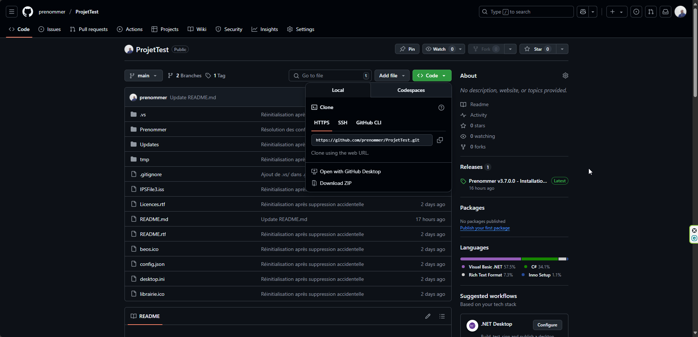
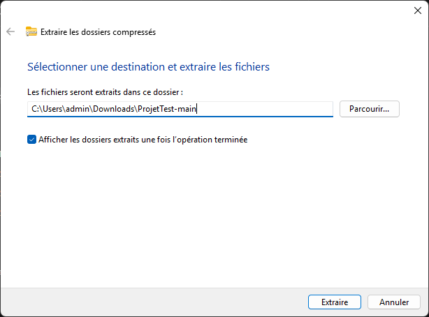
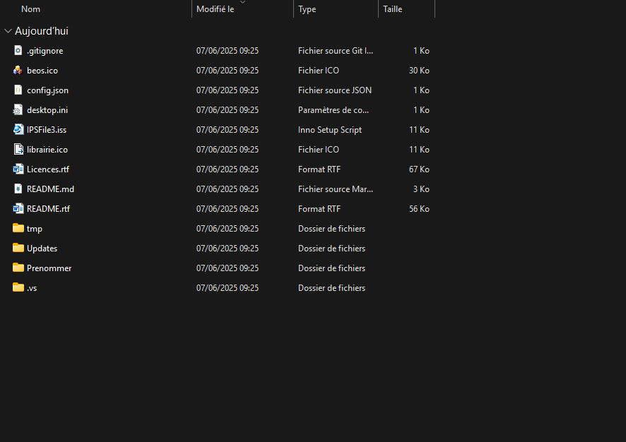
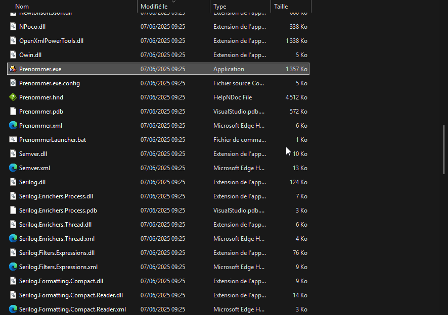
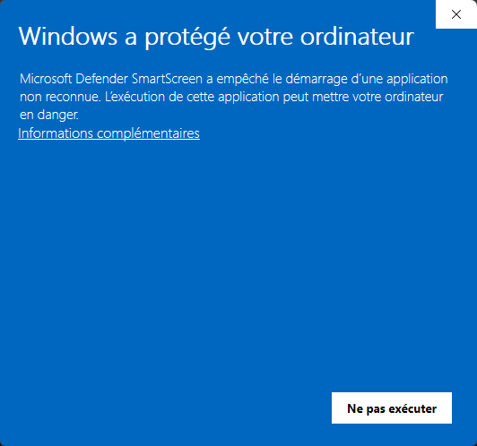
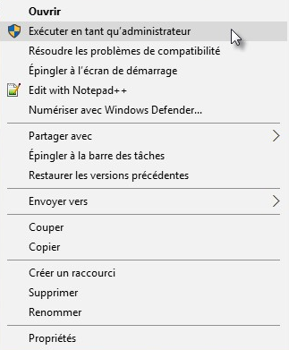
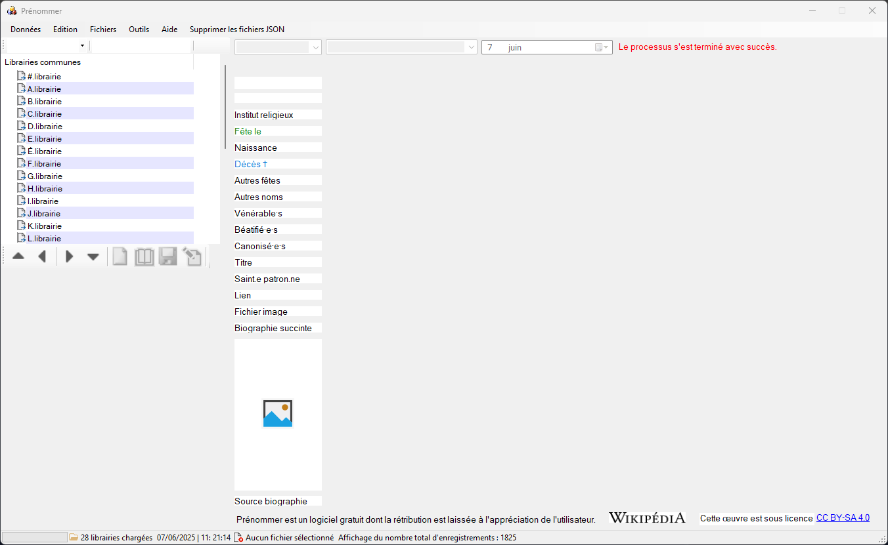
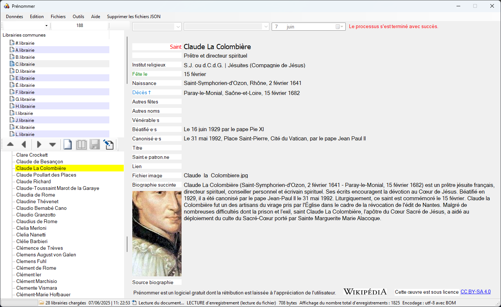

🖋 *Prénommer est une application dédiée à l’exploration des prénoms et à l’hagiographie contemporaine.*

Elle vous permet de **découvrir un vaste choix de prénoms**, en explorant entre autres leurs **significations, origines, fêtes et histoires captivantes**.

Au-delà des prénoms, **Prénommer** vous invite à plonger dans les **vies des saints et des bienheureux**, offrant une approche unique et enrichissante de ces figures inspirantes.

Que vous soyez à la recherche du **prénom idéal pour un enfant**, curieux d’en apprendre davantage sur l’histoire des noms, ou passionné par l’hagiographie, **cette application est votre guide incontournable**.

**📝 📂 Section 2 : Téléchargement et extraction**

💡 **Objectif** : Expliquer où télécharger **Prenommer.exe**, comment extraire les fichiers, et organiser le contenu pour une utilisation optimale.

**Téléchargement de Prenommer.exe**

**📌 Étape 1 : Accéder au fichier d’installation**

1. Rendez-vous sur la page GitHub du projet.

2. Recherchez la dernière version stable de l’application.

3. Téléchargez l’archive contenant le programme (**.zip**).

💡 *Assurez-vous d’avoir une connexion stable pour éviter les interruptions pendant le téléchargement.*

📷 **Image 1** : Page de téléchargement de **Prenommer.exe** avec le lien officiel.

**Extraction du fichier ZIP**

**📌 Étape 2 : Décompression du dossier**

1. Accédez au dossier où se trouve l’archive téléchargée (**ProjetTest-main.zip**).

2. **Clic droit** sur le fichier et sélectionnez *Extraire tout* ou *Extraire ici*.

3. Une fois l’extraction terminée, vous devriez voir un dossier **ProjetTest-main** contenant les fichiers nécessaires à l’utilisation du programme.

📷 **Image 2** : Fichier ZIP avant extraction. 📷 **Image 3** : Contenu du dossier après extraction.

**📂 Ajout du chemin de Prenommer.exe dans la section 3**

💡 **Chemin exact après extraction et organisation du projet** Après extraction, **Prenommer.exe** se trouve par défaut dans : 📌 C:\\Users\\admin\\Downloads\\ProjetTest-main\\ProjetTest-main\\Prenommer\\Prenommer\\bin\\Debug\\Prenommer.exe

💡 **Conseil** : Pour un accès plus rapide et une meilleure organisation, il est recommandé de **déplacer l’exécutable dans un dossier dédié**, par exemple C:\\Program Files\\Prenommer\\Prenommer.exe.

**📝 📂 Section 3 : Exécution de Prenommer.exe**

💡 **Objectif** : Expliquer **comment exécuter l’application**, les éventuels blocages et les solutions pour y remédier.

**Lancer Prenommer.exe**

**📌 Étape 1 : Ouvrir l’application**

1. Accédez au dossier où se trouve **Prenommer.exe**.

2. Pour exécuter **temporairement** un programme en tant qu'administrateur, cliquez avec le bouton droit sur le fichier exécutable dans le dossier d'installation et sélectionnez "Exécuter en tant qu'administrateur"*.*

3. **Double-cliquez sur le fichier** pour le lancer.

4. Si Windows affiche une alerte (*Windows SmartScreen*), procédez comme expliqué ci-dessous.

📷 **Image 4** : Icône de **Prenommer.exe** prête à être exécutée.

**Alerte Windows SmartScreen**

**📌 Étape 2 : Déblocage du programme**

Lors du lancement, Windows peut afficher une alerte *"Windows a protégé votre ordinateur"*, car le programme n’est pas reconnu.

1. Cliquez sur **Informations complémentaires**.

2. Puis sélectionnez **Exécuter quand même**.

**Vérifier les paramètres de SmartScreen**

Windows Defender SmartScreen peut bloquer l’installation d’applications non reconnues.

Windows bloque certaines applications pour des raisons de sécurité grâce à des fonctionnalités comme SmartScreen et UAC. Vous pouvez contourner ces restrictions en **exécutant l'application en tant qu'administrateur, en la débloquant via les propriétés du fichier ou en désactivant temporairement SmartScreen.**

📷 **Image 6** : Capture de l’alerte SmartScreen et les options de déblocage.

💡 *Pourquoi cette alerte ?* Windows bloque parfois les applications non signées pour éviter des risques. **Prenommer.exe est sûr**, mais il est nécessaire de **le débloquer manuellement**.

**Exécution avec les droits administrateurs**

**📌 Étape 3 : Exécution recommandée**

Pour éviter tout problème de permission : 🔹 **Clic droit** sur **Prenommer.exe**. 🔹 Sélectionnez **Exécuter en tant qu’administrateur**.

📷 **Image 5** : Menu clic droit permettant de choisir *Exécuter en tant qu’administrateur*.

💡 *Ce mode garantit un fonctionnement optimal sans restriction système.*

**📝 📂 Section 4 : Déblocage et utilisation**

💡 **Objectif** : Expliquer **comment utiliser Prenommer** une fois lancé, avec un exemple concret d'affichage et de manipulation des fiches.

**Interface principale**

**📌 Étape 1 : Découverte de l’application**

Une fois **Prenommer.exe** exécuté, l’utilisateur découvre l’interface principale, qui permet d’accéder aux fonctionnalités essentielles : ✔ **Recherche de prénoms** et consultation des fiches. ✔ **Exploration des vies des saints et bienheureux**. ✔ **Accès aux paramètres et options de personnalisation**.

📷 **Image 8** : Interface de **Prenommer** ouverte sans fiche chargée.

💡 *À ce stade, l’application est prête à l’emploi. L’utilisateur peut commencer à naviguer et rechercher des prénoms.*

**Exemple d’utilisation avec une fiche**

**📌 Étape 2 : Consultation d’un prénom**

1. **Sélectionnez un prénom** dans la liste ou **recherchez un nom** via le champ dédié.

2. Une fiche détaillée apparaît avec :

   * **Signification du prénom**

   * **Origine et variantes**

   * **Date de fête**

   * **Éléments historiques et anecdotes**

📷 **Image 9** : Exemple de fiche affichée dans **Prenommer** (Claude).

💡 *Les fiches permettent aux utilisateurs de découvrir des informations précises et enrichissantes sur chaque prénom.*

**📌 FAQs – Questions Fréquentes**

**1\. Où puis-je télécharger Prenommer.exe ?**

👉 Le fichier est disponible sur la page GitHub du projet, sous la section des dernières versions stables.

**2\. Windows bloque l’exécution de Prenommer.exe. . Que faire ?**

👉 Windows SmartScreen peut afficher une alerte. Cliquez sur **Informations complémentaires** puis **Exécuter quand même** pour lancer l’application.

**3\. Puis-je installer Prenommer sur macOS ou Linux ?**

👉 Pour le moment, Prenommer est conçu pour Windows. Une version compatible avec d'autres systèmes pourrait être envisagée à l’avenir.

**4\. Pourquoi mon antivirus détecte Prenommer.exe comme une menace ?**

👉 Certains antivirus marquent les exécutables non signés comme suspects. Ajoutez Prenommer.exe à la liste des exceptions pour éviter les blocages.

**5\. Puis-je personnaliser l’interface ou les fiches des prénoms ?**

👉 Oui, Prenommer offre plusieurs options de personnalisation dans ses paramètres.

**6\. J’ai un problème technique, comment obtenir de l’aide ?**

👉 Consultez la documentation en ligne ou ouvrez une **issue** sur le GitHub du projet.